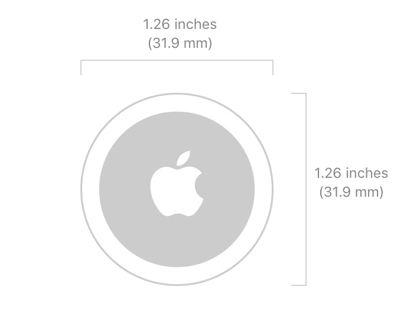

## Context
Sentiment Analysis, or Opinion Mining, is a sub-field of Natural Language Processing (NLP) that tries to identify and extract opinions within a given text
The aim of sentiment analysis is to gauge sentiments, evaluations, attitudes and emotions of a speaker/writer based on the computational treatment of subjectivity in a text.

Why perform sentiment analysis?

- Manage critical posts on social media
- Improve the Customer Experience
- Assess the impact of sponsorships
- Discover new market trends
- Maintain the quality of the service on a national,international and global scale

## Objective
The purpose of the project is to perform sentiment analysis about a product (Apple AirTag) gathering tweets by scraping. After that all results are showcased on a static report built with Datapane and a data app built with Streamlit.

[Link to the jupyter_notebook](https://colab.research.google.com/drive/1vHWK1w4kVUFyE0G3WOqXU0LiSaTN6U4A?usp=sharing)

Here's the pipeline

## Methods Used

* Scraping: gather tweets with Twitter API and the library tweepy
* Text preprocessing: text cleaning and transformations with NLTK and tweet-preprocessor
* Sentiment Analysis: performed with TextBlob. There is a comparison with Azure Cognitive Service and VADER in the notebook also.
* Data Visualization: made with Plotly
* Data Consumption: static report made with Datapane and Data App with Streamlit

## Libraries
* Tweepy
* NLTK
* tweet-preprocessor
* TextBlob
* Ploltly
* Datapane
* Streamlit

## Results
### DataPane

[Link to the datapane_report](https://datapane.com/u/airaghidavide/reports/O7vxBpA/apple-airtag-sentiment-analysis/)

